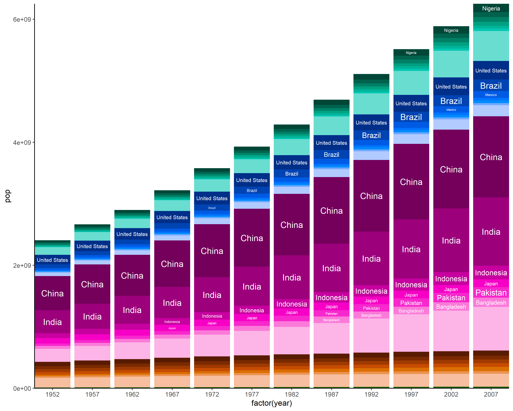
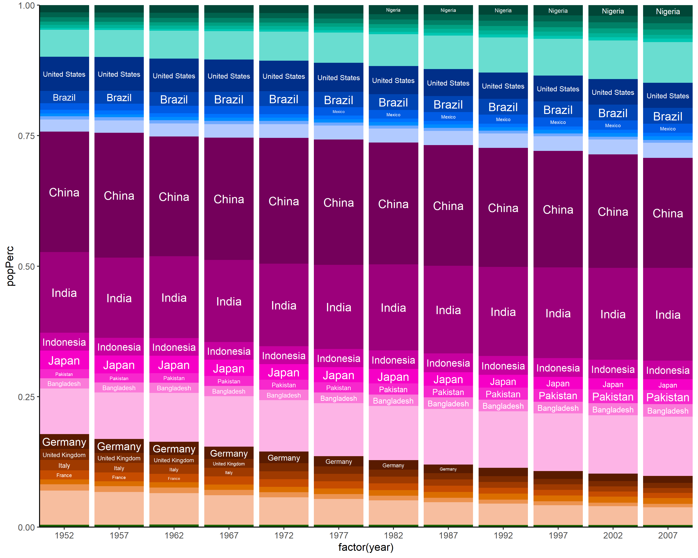
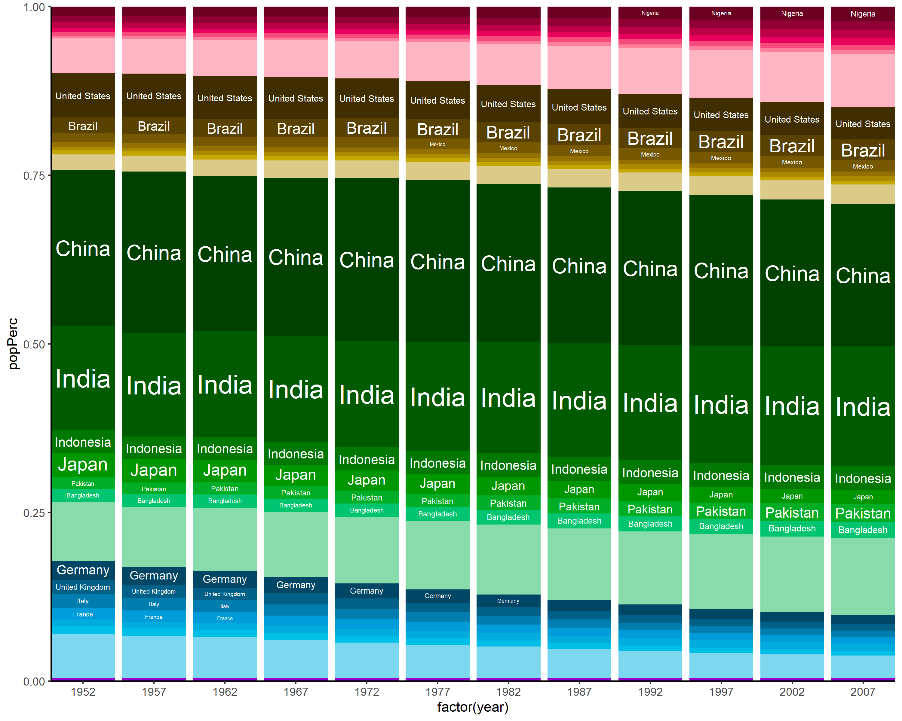

<!-- README.md is generated from README.Rmd. Please edit that file -->

# hueR

<!-- badges: start -->

[](http://github.com/badges/stability-badges)
<!-- badges: end -->

hueR lets you create colour palettes based on two variables: variable
`a` defining the hue, and variable `b` defining the shades of that hue.

This is intended for grouped categorical data, where values of `b`
represent subcategories of the values of `a`.

## Installation

You can install the latest development version of hueR with:

``` r
devtools::install_github("david-barnett/hueR")
```

## Example

``` r
library(hueR)
library(dplyr)
#> 
#> Attaching package: 'dplyr'
#> The following objects are masked from 'package:stats':
#> 
#>     filter, lag
#> The following objects are masked from 'package:base':
#> 
#>     intersect, setdiff, setequal, union
library(ggplot2)
```

``` r
# sort countries, within continents, by average population
sortedSummary <- gapminder::gapminder %>%
  group_by(continent, country) %>%
  summarise(AvPop = mean(pop, na.rm = TRUE), .groups = "keep") %>%
  group_by(continent) %>%
  arrange(.by_group = TRUE, desc(AvPop))

# create palettes
countryPal7 <- sortedSummary %>%
  hueGroupPal(group = "continent", shade = "country", maxShades = 7)

# plot population per year
gapminder::gapminder %>%
  ggplot(aes(
    x = factor(year), y = pop,
    # setting as factor with levels in correct order ensures ordering of bars
    fill = factor(country, levels = names(countryPal7))
  )) +
  geom_col() +
  guides(fill = "none") +
  # setting manual scale of course sets correct colours
  scale_fill_manual(values = countryPal7) +
  ggfittext::geom_fit_text(
    aes(ymin = 0, ymax = pop, label = country),
    position = "stack", colour = "white"
  ) +
  theme_classic() +
  coord_cartesian(expand = FALSE)
```



``` r
# plot population per year as share of world total that year
gapminder::gapminder %>%
  group_by(year) %>%
  mutate(popPerc = pop/sum(pop, na.rm = TRUE)) %>%
  ggplot(aes(
    x = factor(year), y = popPerc,
    # setting as factor with levels in correct order ensures ordering of bars
    fill = factor(country, levels = names(countryPal7))
  )) +
  geom_col() +
  guides(fill = "none") +
  # setting manual scale of course sets correct colours
  scale_fill_manual(values = countryPal7) +
  ggfittext::geom_fit_text(
    aes(ymin = 0, ymax = popPerc, label = country),
    position = "stack", colour = "white"
  ) +
  theme_classic() +
  coord_cartesian(expand = FALSE)
```



``` r
# plot with modified palette
countryPal7alt <- sortedSummary %>%
  hueGroupPal(group = "continent", shade = "country", maxShades = 7,
              hues = hueSet(start = 0))

gapminder::gapminder %>%
  group_by(year) %>%
  mutate(popPerc = pop/sum(pop, na.rm = TRUE)) %>%
  ggplot(aes(
    x = factor(year), y = popPerc,
    # setting as factor with levels in correct order ensures ordering of bars
    fill = factor(country, levels = names(countryPal7alt))
  )) +
  geom_col() +
  guides(fill = "none") +
  # setting manual scale of course sets correct colours
  scale_fill_manual(values = countryPal7alt) +
  ggfittext::geom_fit_text(grow = TRUE,
                           aes(ymin = 0, ymax = popPerc, label = country),
                           position = "stack", colour = "white"
  ) +
  theme_classic() +
  coord_cartesian(expand = FALSE)
```



## Session info

``` r
devtools::session_info()
#> - Session info ---------------------------------------------------------------
#>  setting  value                       
#>  version  R version 4.1.1 (2021-08-10)
#>  os       Windows 10 x64              
#>  system   x86_64, mingw32             
#>  ui       RTerm                       
#>  language (EN)                        
#>  collate  English_United States.1252  
#>  ctype    English_United States.1252  
#>  tz       Europe/Berlin               
#>  date     2021-09-27                  
#> 
#> - Packages -------------------------------------------------------------------
#>  package     * version    date       lib source        
#>  assertthat    0.2.1      2019-03-21 [1] CRAN (R 4.0.0)
#>  cachem        1.0.6      2021-08-19 [1] CRAN (R 4.1.1)
#>  callr         3.7.0      2021-04-20 [1] CRAN (R 4.1.1)
#>  cli           3.0.1      2021-07-17 [1] CRAN (R 4.1.0)
#>  colorspace    2.0-2      2021-06-24 [1] CRAN (R 4.0.5)
#>  crayon        1.4.1      2021-02-08 [1] CRAN (R 4.0.4)
#>  DBI           1.1.1      2021-01-15 [1] CRAN (R 4.0.3)
#>  desc          1.3.0      2021-03-05 [1] CRAN (R 4.0.4)
#>  devtools      2.4.2      2021-06-07 [1] CRAN (R 4.1.1)
#>  digest        0.6.27     2020-10-24 [1] CRAN (R 4.0.3)
#>  dplyr       * 1.0.7      2021-06-18 [1] CRAN (R 4.0.5)
#>  ellipsis      0.3.2      2021-04-29 [1] CRAN (R 4.0.5)
#>  evaluate      0.14       2019-05-28 [1] CRAN (R 4.0.0)
#>  fansi         0.5.0      2021-05-25 [1] CRAN (R 4.0.5)
#>  farver        2.1.0      2021-02-28 [1] CRAN (R 4.0.4)
#>  fastmap       1.1.0      2021-01-25 [1] CRAN (R 4.0.3)
#>  fs            1.5.0      2020-07-31 [1] CRAN (R 4.0.2)
#>  gapminder     0.3.0      2017-10-31 [1] CRAN (R 4.0.2)
#>  generics      0.1.0      2020-10-31 [1] CRAN (R 4.0.3)
#>  ggfittext     0.9.1      2021-01-30 [1] CRAN (R 4.1.1)
#>  ggplot2     * 3.3.5      2021-06-25 [1] CRAN (R 4.0.5)
#>  glue          1.4.2      2020-08-27 [1] CRAN (R 4.0.2)
#>  gtable        0.3.0      2019-03-25 [1] CRAN (R 4.0.0)
#>  highr         0.9        2021-04-16 [1] CRAN (R 4.1.1)
#>  htmltools     0.5.2      2021-08-25 [1] CRAN (R 4.1.1)
#>  hueR        * 0.0.0.9000 2021-09-27 [1] local         
#>  knitr         1.34       2021-09-09 [1] CRAN (R 4.1.1)
#>  labeling      0.4.2      2020-10-20 [1] CRAN (R 4.0.3)
#>  lifecycle     1.0.1      2021-09-24 [1] CRAN (R 4.1.1)
#>  magrittr      2.0.1      2020-11-17 [1] CRAN (R 4.0.3)
#>  memoise       2.0.0      2021-01-26 [1] CRAN (R 4.1.1)
#>  munsell       0.5.0      2018-06-12 [1] CRAN (R 4.0.0)
#>  pillar        1.6.3      2021-09-26 [1] CRAN (R 4.1.1)
#>  pkgbuild      1.2.0      2020-12-15 [1] CRAN (R 4.0.3)
#>  pkgconfig     2.0.3      2019-09-22 [1] CRAN (R 4.0.0)
#>  pkgload       1.2.2      2021-09-11 [1] CRAN (R 4.1.1)
#>  prettyunits   1.1.1      2020-01-24 [1] CRAN (R 4.0.0)
#>  processx      3.5.2      2021-04-30 [1] CRAN (R 4.1.1)
#>  ps            1.6.0      2021-02-28 [1] CRAN (R 4.0.4)
#>  purrr         0.3.4      2020-04-17 [1] CRAN (R 4.0.0)
#>  R6            2.5.1      2021-08-19 [1] CRAN (R 4.0.5)
#>  remotes       2.4.0      2021-06-02 [1] CRAN (R 4.1.1)
#>  rlang         0.4.11     2021-04-30 [1] CRAN (R 4.0.5)
#>  rmarkdown     2.11       2021-09-14 [1] CRAN (R 4.1.1)
#>  rprojroot     2.0.2      2020-11-15 [1] CRAN (R 4.0.3)
#>  rstudioapi    0.13       2020-11-12 [1] CRAN (R 4.0.3)
#>  scales        1.1.1      2020-05-11 [1] CRAN (R 4.0.0)
#>  sessioninfo   1.1.1      2018-11-05 [1] CRAN (R 4.0.0)
#>  stringi       1.7.4      2021-08-25 [1] CRAN (R 4.1.1)
#>  stringr       1.4.0      2019-02-10 [1] CRAN (R 4.0.0)
#>  testthat      3.0.4      2021-07-01 [1] CRAN (R 4.0.5)
#>  tibble        3.1.4      2021-08-25 [1] CRAN (R 4.1.1)
#>  tidyselect    1.1.1      2021-04-30 [1] CRAN (R 4.0.5)
#>  usethis       2.0.1      2021-02-10 [1] CRAN (R 4.0.4)
#>  utf8          1.2.2      2021-07-24 [1] CRAN (R 4.1.1)
#>  vctrs         0.3.8      2021-04-29 [1] CRAN (R 4.0.5)
#>  withr         2.4.2      2021-04-18 [1] CRAN (R 4.0.5)
#>  xfun          0.26       2021-09-14 [1] CRAN (R 4.1.1)
#>  yaml          2.2.1      2020-02-01 [1] CRAN (R 4.0.0)
#> 
#> [1] C:/Program Files/R/R-4.1.1/library
```
